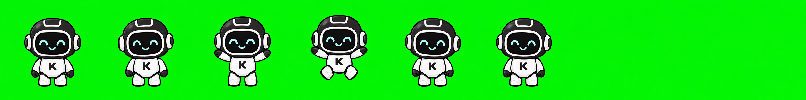

# Kimi Pet 🐾

A transparent, always-on-top desktop pet for [Kimi Code](https://kimi.moonshot.cn/) that reacts to your coding session in real time.



## Features

- **Live state animations** — idle, thinking, tool_use, editing, terminal, waiting_approval, success, error
- **Lifecycle hook integration** — listens to Kimi Code CLI/VS Code events via `~/.kimi/config.toml` hooks
- **Desktop companion** — frameless, transparent, drag-to-move, resizable Electron window
- **VS Code side panel** — optional webview companion extension
- **Web preview** — open `apps/web-preview` in a browser for a quick demo
- **MCP server** — expose `pet_set_state`, `pet_say`, `pet_notify` tools
- **`/pet` slash command** — launch the daemon + desktop pet from Kimi Code chat

## Quick Start

### Requirements

- Node.js 20+
- pnpm 8+ (or use `corepack pnpm`)
- Windows / macOS / Linux (Electron desktop; web preview works everywhere)

### One-shot install

```bash
# Clone the repo
git clone https://github.com/yourname/kimi-pet.git
cd kimi-pet

# Install deps, build, and register hooks + /pet command
node scripts/install-all.mjs
```

### Launch the pet

In **Kimi Code chat** (CLI or VS Code extension), type:

```text
/pet
```

Or run the launcher directly:

```bash
node scripts/start-pet.mjs
```

In VS Code you can also run the command **Kimi Pet: Launch Desktop Pet** from the Command Palette (`Ctrl+Shift+P`).

The script starts the daemon (if needed) on port `17373` and opens the desktop pet window.

## How It Works

```text
Kimi Code CLI/VS Code
        │
        ▼
  lifecycle hooks
        │
        ▼
  kimi-pet-hook
        │
        ▼
   pet-daemon  ◀───────  MCP tools / manual events
        │
        ├──▶  desktop Electron window
        ├──▶  VS Code companion webview
        └──▶  web preview
```

See [`docs/ARCHITECTURE.md`](docs/ARCHITECTURE.md) for the full design.

## Project Structure

```text
kimi-pet/
├── apps/
│   ├── desktop/            # Electron transparent pet window
│   ├── vscode-companion/   # VS Code extension panel
│   └── web-preview/        # Browser demo
├── packages/
│   ├── pet-core/           # State machine + Kimi event mapping
│   ├── pet-daemon/         # HTTP/WebSocket daemon
│   ├── pet-assets/         # Spritesheet utilities
│   ├── kimi-hooks-adapter/ # Kimi config.toml hook bridge
│   ├── kimi-mcp-server/    # MCP server for pet tools
│   ├── kimi-wrapper/       # Shared Kimi integration helpers
│   └── shared-types/       # Shared TypeScript types
├── pets/
│   └── kimi-robot/         # Default petpack (spritesheet + pet.json)
├── scripts/
│   ├── install-all.mjs           # One-shot setup
│   ├── install-hooks.mjs         # Register Kimi hooks
│   ├── install-slash-command.mjs # Register /pet command
│   ├── install-plugin.mjs        # Register Kimi Code plugin
│   ├── start-pet.mjs             # Launch daemon + desktop
│   └── validate-petpack.mjs      # Validate a petpack
├── docs/
│   ├── ARCHITECTURE.md
│   └── assets/               # Screenshots
└── .kimi/commands/pet.md   # Project-level /pet slash command
```

## Development

```bash
# Install dependencies
pnpm install

# Build all packages and apps
pnpm build

# Start the daemon in dev mode
pnpm dev:daemon

# Run tests
pnpm test

# Validate the default petpack
pnpm validate:petpack
```

## Customizing the Pet

The default petpack lives in `pets/kimi-robot/`:

- `spritesheet.webp` — 8×8 grid of 256×256 animation frames
- `pet.json` — animation metadata (row, frames, fps, loop, next)

Replace or extend these files and restart the daemon. Use `scripts/validate-petpack.mjs` to check your edits.

## Troubleshooting

See [`docs/TROUBLESHOOTING.md`](docs/TROUBLESHOOTING.md) for common issues (Electron download, `/pet` not appearing, daemon port conflicts).

## Roadmap

- [ ] Linux/macOS desktop polish
- [ ] More built-in pets
- [ ] Kimi Code extension-native `/pet` slash command (VS Code chat API)
- [ ] Packaged installer / GitHub Releases

## License

MIT — see [LICENSE](LICENSE).
